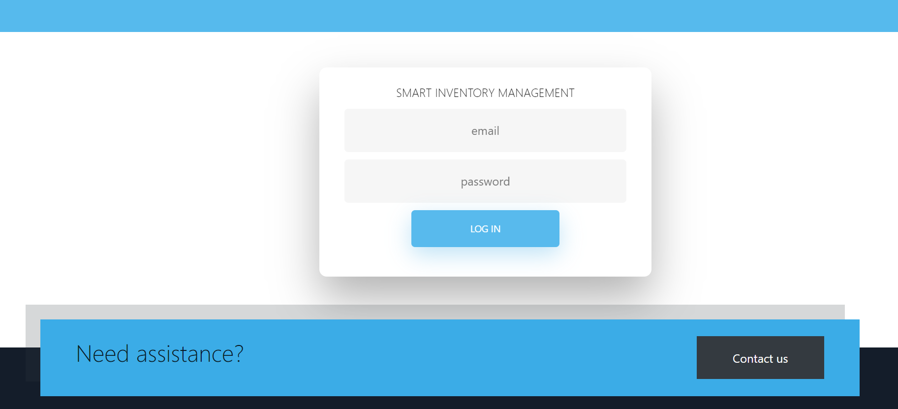
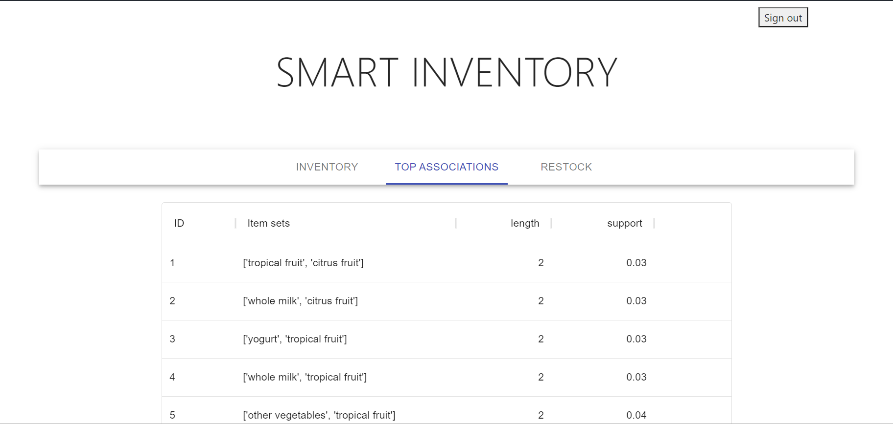
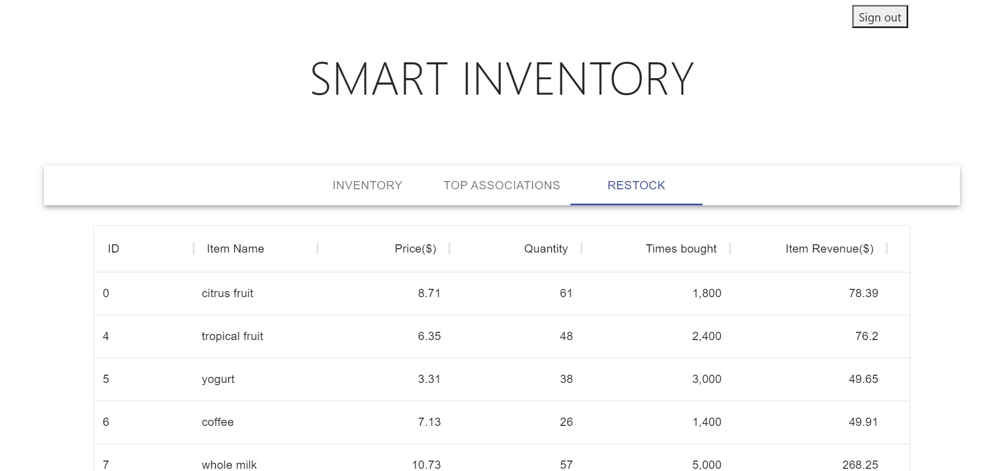

<h3>Smart Inventory Management</h3>

    

        This is a single page application developed for predictive inventory management. 
    
    
    

        It shows the item sets, i.e. the items that are most frequently bought together, and their likeliness to be bought together based on previous data.
    

    

        When a dataset of transactional data is fed as a parameter to this system, it will
        <ol>
            <li>Create a <strong>unique</strong> stock file. It will iterate across the dataset and collect the unique names of each of the products so that no product appears twice across it.</li>
            <li>Create a <strong>one hot encoding</strong> for the transactional data. This means that if an item has been bought in a particular transaction, it will place a 1, and if not, it will place a 0. This makes data much easier to render than in string format. </li>
            <li>This data will then be passed to the apriori algorithm, which is the main basis for <strong>Market Basket Analysis.</strong> This is a machine learning and data mining algorithm that will collect the associations across each of the products. The algorithm has also been extended by us so that it shows the percentage of likeliness that it is being bought at.</li>
            <li>Finally, we have these data being displayed in the front end, which has been developed using React JS. It is a single page application that has been cerated and is live online on firebase <a href="https://auth-dev-6fa29.web.app">here</a>.</li>
            <li>Future work will be done to make the project more efficient and user friendly.</li>
        </ol>
    

    Here are some screenshots to give an idea of what the project looks like, in case the live link does not work:
    

        

            
            
Image: Log In Screen

        

        

            
            
Image: Whole inventory list showing the various details of each product

        

        

            
            
Image: The item sets and their support value (likeliness to be bought together)

        

        

            
            
Image: Table of items for restock

        

    

 

    

        Backend of this project was implemented using:
        <ul>
            <li><a href="https://www.python.org/">Python</a> (3.9.0): for mining data and creating itemsets</li>
            <ul>
                <li><a href="https://pandas.pydata.org/">Pandas</a>: for cleaning and formatting data</li>
                <li><a href="http://rasbt.github.io/mlxtend">MLXtend</a>: for implementing Data Mining algorithms</li>
            </ul>
            <li><a href="https://reactjs.org/">React JS</a>(17.0.2): for creating the front end UI</li>
        </ul>
    

    

        Developed by: 
        <ul>
            <li><a href="https://github.com/snigdho611">Snigdho Dip Howlader</a>: Implemented and improvised the data mining algorithms </li>
            <li><a href="https://github.com/asifsijan">Asif Sijan</a>:  Implemented the front end and created the web pages</li>
        </ul>
    

